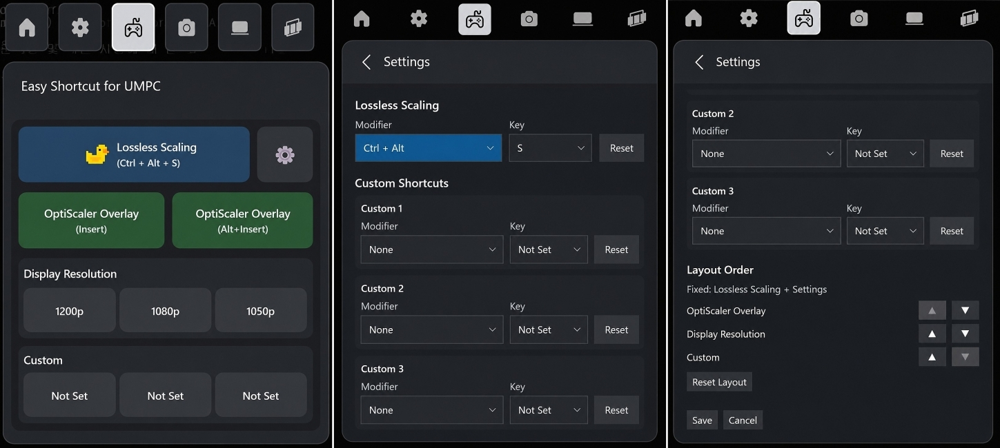

# Easy Shortcut for UMPC

## Designed for UMPCs and handheld Windows PCs

Easy Shortcut for UMPC is designed for UMPCs and handheld Windows gaming PCs.

The widget uses a compact, fixed-width layout with large touch-friendly buttons, making common shortcuts easier to use through Xbox Game Bar on small screens.

## Beta installation

Easy Shortcut for UMPC is currently distributed as a GitHub beta release before Microsoft Store publication.

Download the attached ZIP file from the GitHub release, extract the ZIP, and run `install-Beta.cmd` by double-clicking it. The app will be installed automatically.

## How to use

1. Download the attached ZIP file from the GitHub release.
2. Extract the ZIP file.
3. Run `install-Beta.cmd` by double-clicking it.
4. The app will be installed automatically.
5. Open Xbox Game Bar with `Win + G`.
6. Open **Easy Shortcut for UMPC** from the widget list.
7. Pin the widget if you want it to stay visible while gaming.
8. Tap the shortcut buttons as needed.
9. Press the Settings button to configure custom shortcuts or change the layout order.

## Shortcut list

| Button | Sent shortcut |
|---|---|
| Lossless Scaling | `Ctrl + Alt + S` by default, customizable in Settings |
| OptiScaler Overlay | `Insert` |
| OptiScaler Overlay | `Alt + Insert` |
| Custom 1 | User-configurable |
| Custom 2 | User-configurable |
| Custom 3 | User-configurable |

## Settings

The Settings page lets you customize the widget behavior.

You can:

- Change the Lossless Scaling shortcut
- Reset Lossless Scaling back to `Ctrl + Alt + S`
- Configure Custom 1, Custom 2, and Custom 3
- Reset custom buttons back to `Not Set`
- Change the layout order of widget sections

The Lossless Scaling button and Settings button remain fixed at the top of the widget.

The following sections can be reordered:

- OptiScaler Overlay
- Display Resolution
- Custom

## Custom shortcuts

Easy Shortcut for UMPC includes three customizable shortcut buttons.

Each custom button can be assigned a modifier and a key, such as:

- `Ctrl + Alt + X`
- `Shift + F1`
- `Alt + Enter`
- `Insert`
- `Home`

If a custom button is not configured, it is shown as `Not Set`.

When a `Not Set` custom button is pressed, the Settings page opens so you can assign a shortcut.

### How to configure custom shortcuts

1. Open Xbox Game Bar with `Win + G`.
2. Open **Easy Shortcut for UMPC**.
3. Press the Settings button.
4. Choose a modifier and key for Custom 1, Custom 2, or Custom 3.
5. Press Save.

### Reset behavior

| Item | Reset behavior |
|---|---|
| Lossless Scaling | Restores `Ctrl + Alt + S` |
| Custom 1 | Resets to `Not Set` |
| Custom 2 | Resets to `Not Set` |
| Custom 3 | Resets to `Not Set` |

### Supported modifiers

- None
- Ctrl
- Alt
- Shift
- Ctrl + Alt
- Ctrl + Shift
- Alt + Shift
- Ctrl + Alt + Shift

### Supported keys

Custom shortcuts support common keyboard keys, including:

- A-Z
- 0-9
- F1-F12
- Insert
- Delete
- Home
- End
- Page Up
- Page Down
- Space
- Tab
- Escape
- Arrow keys

## Display Resolution

The resolution-switching feature is intended for UMPCs and handheld Windows PCs.

Resolution buttons are shown only when the device is using its internal display.  
For compatibility and stability reasons, the resolution buttons are hidden when an external monitor is connected.

Available resolution options depend on the detected internal display resolution:

| Internal display | Available options |
|---|---|
| 1200p | 1200p, 1080p, 1050p |
| 1080p | 1080p, 900p, 720p |

> [!NOTE]
> The resolution-switching feature is intended for UMPC standalone mode.
> On desktop PCs or devices using an external display, the resolution buttons will not be shown.

## Notes

> [!NOTE]
> Some games or applications may block simulated keyboard input.
>
> Some system-level apps or elevated/admin apps may not respond to shortcuts from the widget.
>
> Display resolution controls are available only on supported internal displays.
>
> Resolution controls are hidden when an external display is detected.
>
> Xbox Game Bar must be enabled.

## Requirements

- Windows 10/11 with Xbox Game Bar support
- Xbox Game Bar enabled
- Sideloading enabled if required by your Windows settings

## License

This project is licensed under the GNU General Public License v3.0.

## License

Easy Shortcut for UMPC is released under the GNU General Public License v3.0.

You may use, modify, and redistribute this project under the terms of the GPL-3.0 license.  
If you distribute modified versions or binaries, you must also provide the corresponding source code under the same license.
